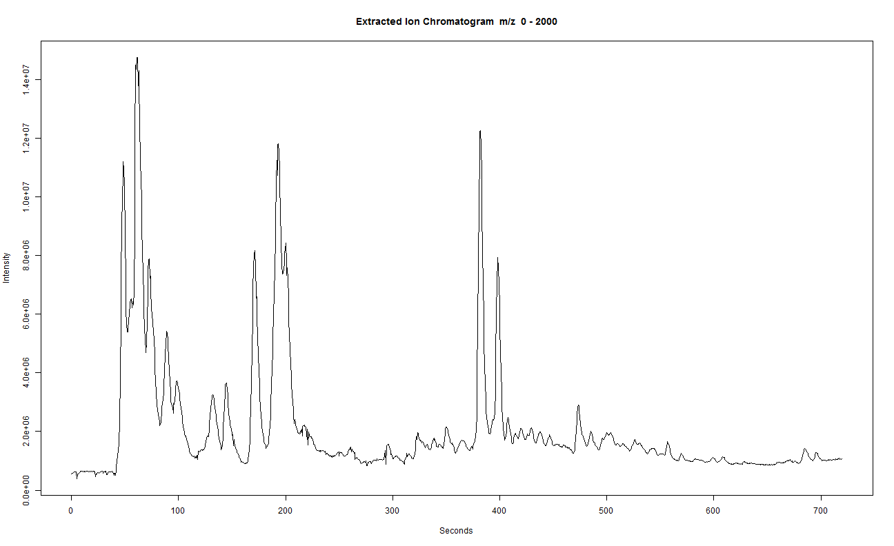
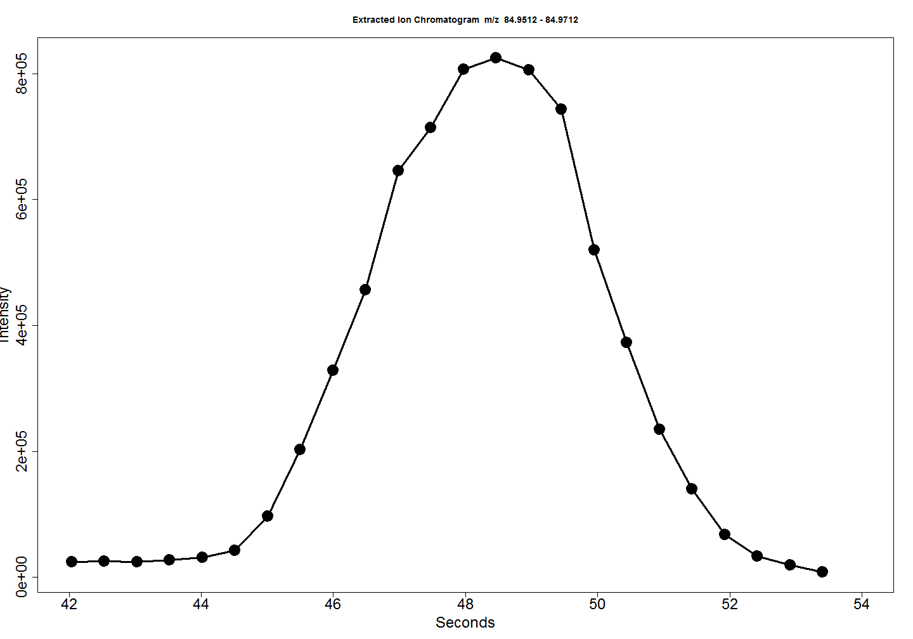
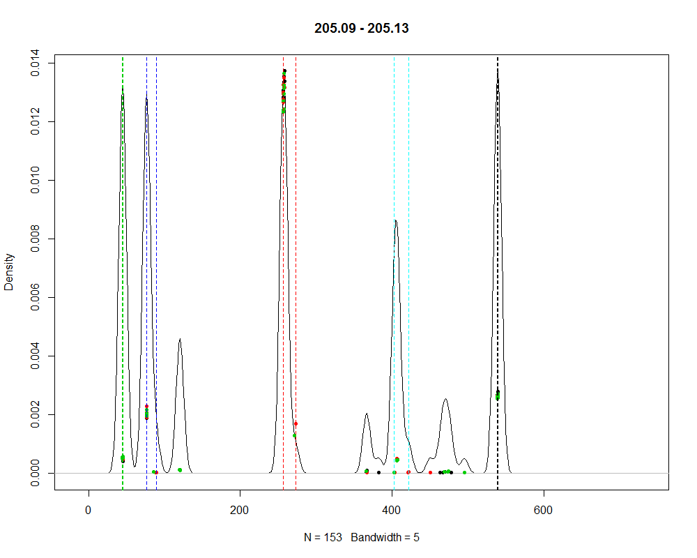
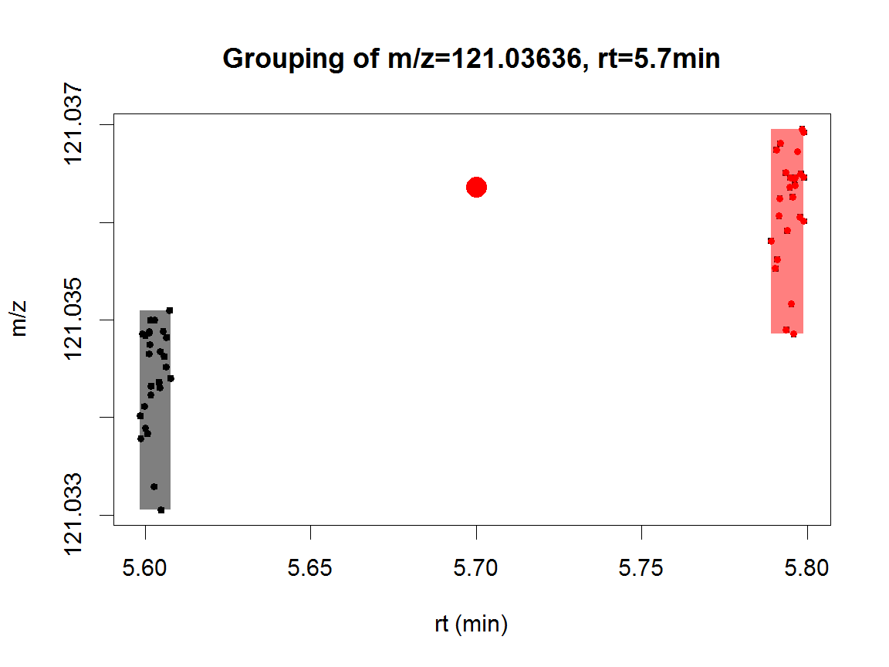

<style>
.centerpage {
margin: auto !important;
width: 1200px;
}

.reveal h1 {
text-align: center;
font-weight: bold;
font-size: 6em;
padding-top: 1em;
}
</style>


XCMS workshop 2017
========================================================
author:
date:
autosize: true
width: 2540
height: 1429


<div style="color: white; text-align: center;padding-top: 8em;">
  <p style="font-size: 2em;margin-bottom: 0.5em;">
    Jan Stanstrup
  </p>
  <p style="margin-top: 0.5em;font-size: 1.3em;">
    
    @JanStanstrup
    <br>
    stanstrup@gmail.com
  </p>
  <p style="font-size: 1.3em;margin-top: 2em;">
    2017/06/25
    <br><br>
    Steno Diabetes Center Copenhagen, Denmark
  </p>
</div>


Outline
========================================================
type: sub-section

<div style="font-size: 1.3em; text-align: center;line-height: 150%; padding-top:100px; padding-bottom: 140px;">
<br>
<ol type="1">
<li><a href="#/why">What does the data look like?<br>Why pre-processing?</a></li>
<li><a href="#/peakpick">Peak picking</a></li>
<li><a href="#/group">Grouping</a> peaks</li>
<li><a href="#/retcor">Retention time correction</a></li>
<li><a href="#/fillPeaks">Filling</a> missing values<br><br></li>
<li><a href="#/check">Checking the results and troubleshooting</a></li>
<li><a href="#/stats">Getting quick stats</a></li>
</ol>
</div>


<div align="center">
<p>
<i>The data used in this presentation was kindly provided by Drs. Richard and Nichole Reisdorph and their <a href="http://www.ucdenver.edu/academics/colleges/pharmacy/Research/CoreFacilities/Spectrometry/Pages/default.aspx">Mass Spectrometry Laboratory</a></i>
</p>
<p>
<i>This presentation and sample data can be found at <a href="https://github.com/stanstrup/XCMS-course">github.com/stanstrup/XCMS-course</a></i>
</p>
</div>


What does the data look like? Why pre-processing?
========================================================
id: why
type: sub-section

<br>
<p style="font-size: 1.5em;">Why are we here and why do we need to do this?</p>


What does the data look like? Why pre-processing?
========================================================

<div align="center">
<br>
</div>


What does the data look like? Why pre-processing?
========================================================

<br><br>

<div align="center">
<br>
</div>

<br><br>

<p style="font-size: 1.2em; text-align; center;">Simply to do. Difficult to do well. Impossible to do perfectly.</p>


XCMS
========================================================
<br>

* R package
* First published in 2006[1] by Colin A. Smith *et al.* at The Scripps Research Institute (Patti Lab).
* Open source: https://github.com/sneumann/xcms
* The 'X' in the XCMS denotes that it can be used for an chromatography (***G***C/***L***C)
* Maintained for many years primarily by Steffen Neumann and his group
* New major version being developed by Johannes Rainer (EURAC Research , Bolzano, Italy)


Peak picking
========================================================
type: sub-section
id: peakpick

<br>
<p style="font-size: 1.5em">Is this a peak or just noise?</p>


Find the files
========================================================

<br>

First we locate the files.
They need to be in an open format: 
* mzML (newest)
* mzData
* mzXML (most widely supported)
* netCDF (obsolete, last resort)

<br>

Lets make a list of the files we want to pre-process.

```r
files <- list.files("_data", recursive = TRUE, full.names = TRUE, pattern=".mzXML")
head(files,5)
```

```
[1] "_data/A/POOL_1_A_1.mzXML" "_data/A/POOL_1_A_2.mzXML"
[3] "_data/A/POOL_1_A_3.mzXML" "_data/A/POOL_2_A_1.mzXML"
[5] "_data/A/POOL_2_A_2.mzXML"
```

<br>
Blanks interfer with peak alignment since there are so few peaks. <br>
So, better remove them before starting. Same goes for compound mixtures.


Peak picking
========================================================
incremental: true

<br><br>

Now we can do peak picking. We need to load some packages first.


```r
suppressMessages(library(xcms)) # suppress avoids a flood of messages
suppressMessages(library(BiocParallel))
```

<br>
Now lets do the peak picking.<br>
There are many parameters to set that we will explain in a sec.<br>
There are a few more settings available but these are the most important.


```r
xset <- xcmsSet(files, 
                BPPARAM  = SerialParam(),
                method = 'centWave',
                prefilter = c(3,1E3),
                ppm = 30,
                snthr = 1E2,
                profparam = list(step=0.01),
                peakwidth = c(0.05*60,0.20*60),
                verbose.columns	= TRUE,
                fitgauss = TRUE
                )
```


Peak picking - BPPARAM
========================================================

<br>
By default the newest XCMS uses all available cores.<br>
Before we set it to use a single core (SerialParam) just because it works better for generating this presentation.

To control the number of cores you could for example do:

```r
library(parallel)
```

and set:


```r
BPPARAM  = SnowParam(detectCores()-1, progressbar = TRUE)
```

<br><br>

* `SnowParam()` on windows
* `MulticoreParam()` on linux


Peak picking - which method?
========================================================
class: centerpage

<br>

**matchedfilter**[1]
* Original algoritm
* Developed for nominal mass instruments
   * Therefore good for low accuracy data
   * Also works for accurate mass data
* Good for chromatographically noisy data
* Fixed width peak fitting
* Bins data in *m/z* dimension

<br>
**centWave**[2]
* Developed for accurate mass instruments
* Handles different peak widths better
* prefilter makes it faster
* Usually the best if the data is "nice"
* Bin-less approach

***

<br>

**massifquant**[3]
* Developed (among other reasons) to better handle variable mass accuracy and peak shapes
* Bin-less approach
* No personal experience but from the paper it appears that:
   * Good at finding low intensity and low "quality" peaks
   * More prone to false positives (picking noise) than centWave


Peak picking - What peak picking does
========================================================

Here we will go through peakpicking with the centwave algorithm[2].<br>

* First it finds *regions of interest* (ROIs). <br> Those are where there could be a peak: Stable mass for a certain time.
* Next the peak shape is evaluated.
* The peak is expanded beyond the ROI if needed.

<div align="center">
<br>
<i>Figure from Tautenhahn, Böttcher and Neumann, 2008 (centWave paper)</i>
</div>


Peak picking - What peak picking does
========================================================

<div align="center">
<br>
<i>Figure from Tautenhahn, Böttcher and Neumann, 2008 (centWave paper)</i>
</div>


Peak picking - Prefilter
========================================================
class: centerpage

<br>


```r
prefilter = c(3,1E3)
```

<br><br>

* Says to only consider regions where there are at least `3` scans with intensity above `1000`.
* Check your peak widths to see how many scans per peak you are sure to have.
* For the intensity set to approximately the intensity of the random noise you see in a spectrum.


Peak picking - Peak width
========================================================

Centwave asks you to set the minimum and maxmimum peak widths you have in your data.<br>
<br>
You set it in seconds (always seconds in XCMS) and this is what we did before.
<br>


```r
peakwidth = c(0.05*60,0.20*60)
```

It is a vector of length 2 with the  min and max length.
<br><br>

To determine reasonable values we need to look at the raw data (you'd probably use something interactive such as MzMine (or future XCMS!)).<br>
Here is a TIC:
<br>

```r
xraw <- xcmsRaw(xset@filepaths[1])
plotEIC(xraw, mzrange=c(0, 2000), , rtrange=c(0,  12*60))
```




Peak picking - Peak width
========================================================

Lets zoom in on a peak.


```r
plotEIC(xraw, 
        mzrange=c(84.9612-0.01, 84.9612+0.01), 
        rtrange=c(0.7*60,  0.9*60), 
        type="o", cex=3, pch=19, lwd=3
        )
```




***
<br><br><br><br><br><br><br><br><br>

* So, we can see that this peak has ~15 scans and is about 7 s (~0.1 min) long.
* We could do the same looking at one of the longer peaks at the end of the run.
* If the shortest peak we can find is about 0.1 min I'd go for 0.05 min to be on the safe side. Also multiply what you can find for the longest by 2 to be safe.


Peak picking - Peak width
========================================================

You can also use a 2D plot to try to find short and long peaks.
Here I plotted with MzMine (remember to use the continuous/profile mode toggle otherwise it looks very wrong).
<br>
<div align="center">

</div>


Peak picking - ppm
========================================================

<br>
**ppm:** Relative deviation in the *m/z* dimension<br>
&emsp;&emsp;&nbsp;&nbsp;In the centWave context it is the maximum allowed deviation between scans when locating regions of interest (ROIs).


<br>
Do not use the vendors number. Like the mileage of a car these numbers are far from real world scenarios.<br>
We need a range that is true also for the tails of the peaks.

<br>
What we choose before was:

```r
ppm = 30
```

<br>
A 2D plot is a reasonable way to look at this.


Peak picking - ppm
========================================================

<br>
<div align="center">

</div>


Peak picking - ppm
========================================================

Check the peak bounderies with an EIC.
<br>
<div align="center">

</div>


Peak picking - ppm
========================================================

Check what are actually reasonably sized peaks in the spectrum.
<br>
<div align="center">

</div>


Peak picking - ppm
========================================================

<br>
<div align="center">

</div>


```r
((189.074-189.0690)/189.0690)*1e6
```

```
[1] 26.44537
```


Peak picking - profparam
========================================================

<br>
First we need to clear up the confusion about the difference between *profile mode* data and the *profile matrix*.
<br>

**Profile mode:** The data is continuous in the *m/z* dimension.<br>
As opposed to centroid mode data where you have discrete (sticks) in the *m/z* dimension.

**Profile matrix:** A rt (or scan rather) x *m/z* matrix of *m/z* slices.<br>
XCMS uses this for some procedures (fillPeaks, but not peakpicking) instead of the full raw data. Think of it as binned data with less *m/z* resolution.

<br>
* The profparam parameter says how fine the binning in the *Profile matrix* is going to be.
* It cannot be set too low as slices will be combined as needed. Only memory usage will increase.
* For high dimensional data the default setting can cause problems. So setting something like this will set it to 0.01 Da slices.

<br>


```r
profparam = list(step=0.01)
```


Peak picking - snthr
========================================================

Signal to noise ratio. It really depends on your data. And it is defined differently for centWave and matchedfilter.<br>
It appears to be very unstable even for very similar peaks. So, I suggest to set it low and filter on intensity afterwards if needed.

For centWave I would start with:


```r
snthr = 1E2
```

For matchedfilter I would start with:


```r
snthr = 5
```
               
<br>
If low peaks that you would like to include are missing then lower the value.


Grouping and retention time correction
========================================================
id: group
type: sub-section

<br>
<p style="font-size: 1.5em;">Is this peak the same as that peak?</p>


Grouping and retention time correction
========================================================

<br>

This step tries to group/match features between samples.<br>
**This is probably the most important step!**

<br>
It is a 3 step procedure:

1. Features are grouped according to RT. Loose parameters for matching is used.
2. The matched features are used to model RT shifts. --> retention time correction/alignment.
3. Using the corrected RTs features are matched again with stricter criteria.

<br>
There are three methods for retention time correction/alignment.

1. **LOESS:** Fits a LOESS curve between retention times. Works on the peaktable (therefore fast). The default and usually no reason to look further.
2. **Obiwarp:** Warps the raw data (and hence slow) to a reference sample. Can handle dramatic shifts. Often overfitting. Use if needed with great attention.
3. **Linear:** When all else fails.


Grouping and retention time correction - group
========================================================


```r
xset_g <- group(xset, 
                bw = 0.2*60, 
                minfrac = 0.5, 
                minsamp = 5, 
                mzwid = 0.01, 
                max = 20, 
                sleep = 0
                )

xset_g
```

```
An "xcmsSet" object with 27 samples

Time range: 0.6-720 seconds (0-12 minutes)
Mass range: 60.5133-1418.4605 m/z
Peaks: 97334 (about 3605 per sample)
Peak Groups: 2978 
Sample classes: A, B, C 

Feature detection:
 o Peak picking performed on MS1.
Profile settings: method = bin
                  step = 0.01

Memory usage: 18.4 MB
```


Grouping and retention time correction - group
========================================================

Example of grouping density.

<div align="center">

</div>


Grouping and retention time correction - group bw
========================================================
incremental: true

<br>

**bw**: bandwidth (standard deviation or half width at half maximum) of gaussian smoothing kernel to apply to the peak density chromatogram. <br>

Perhaps a bit obscure definition but it roughly translates to:<br>
The maximum expected RT deviation across samples.

<br>
Overlay the BPI and find the peak with the highest deviation.
<br>

<div  class="fragment" align="center">

</div>


Grouping and retention time correction - group bw
========================================================

<br>
Here we have zoomed. Compare peak apexes.

<br>
<div align="center">

</div>


Calculate the deviation.

```r
4.90-4.78
```

```
[1] 0.12
```

Since there could be small peaks with larger variation than what we found we bump it up to 0.2 min.


Grouping and retention time correction - minfrac/minsamp
========================================================


```r
minfrac = 0.5
minsamp = 5
```

<br>

**minsamp:** minimum number of samples a peak should be found in.

**minfrac:** minimum fraction of samples a peak should be found in.

<br>
**These are used** ***per sample group***.

Files in different subfolders are considered different groups.<br>
The groups can be manipulated by changing:


```r
head(xset@phenoData)
```

```
           class
POOL_1_A_1     A
POOL_1_A_2     A
POOL_1_A_3     A
POOL_2_A_1     A
POOL_2_A_2     A
POOL_2_A_3     A
```

In this dataset we had 3 groups with 9 samples in each. The first time we do the grouping we are pretty liberal with how often it should be found.

Grouping and retention time correction - minfrac/minsamp
========================================================

<br>

**Consider your experimental design and group VERY carefully when you set these parameters!**

Example:


1. You put all files on one folder.
2. You have 2 study groups with each 20 samples. So 40 samples in total.
3. You set:
  
  ```r
  minfrac = 0.7
  minsamp = 30
  ```
4. **You have now removed everything that is unique to one group!** <br>So possibly the most important features have been removed.


Grouping and retention time correction - mzwid
========================================================

<br>


```r
mzwid = 0.01
```
 
<br>
         
How close the m/z need to be the same compound.


 
Grouping and retention time correction - max
========================================================

<br>

**max:** maximum number of groups to identify in a single *m/z* slice.<br>
Meaning how many isomers do you have across a chromatogram.
 
<br>


```r
max = 20
```

<br>
If you are processing GC data remember that many fragments will be isomers. So, set this high.

               
                
Grouping and retention time correction
========================================================
id: retcor


```r
xset_g_r <- retcor(xset_g,
                   method="peakgroups",
                   missing = 3, 
                   extra = 3, 
                   smooth = "loess",
                   span = 0.6, 
                   plottype = "mdevden",
                   col=xset_g@phenoData[,"class"]
                  )
```


Grouping and retention time correction - span
========================================================

<br>

**span:** degree of smoothing for local polynomial regression fitting.<br>
The higher the less flexible the fitting is.<br>
0 == overfitting<br>
1 == only captures very overall trends<br>
<br>
0.4-0.7 is typical in my opinion. 0.2 is default.
<br>
<br>

We set:
<br>


```r
span = 0.6
```


Grouping and retention time correction - span
========================================================

<div style = "height: 650px">
Span: 0.01<br>

</div>

<br>

<div style = "height: 650px">
Span: 0.2<br>

</div>

***

<div style = "height: 650px">
Span: 0.6<br>

</div>

<br>

<div style = "height: 650px">
Span: 1<br>

</div>


Grouping and retention time correction - missing & extra
========================================================

<br>


```r
missing = 3
extra = 3
```

<br>

**missing:** number of missing samples to allow in retention time correction groups<br><br>
**extra:** number of extra peaks to allow in retention time correction correction groups


Grouping and retention time correction - plotting
========================================================

<br>


```r
plottype = "mdevden",
col=xset_g@phenoData[,"class"]
```

<br>

**plottype:**

* "deviation": Plots only the RT deviations
* "mdevden": As "deviation" but adds density plot below

<br><br>

**col:** We can tell it how to color the points/lines in the deviations plot.

* Can be a factor, numeric or a character vector of colors.
* Useful to color by batch.


Grouping and retention time correction - grouping one more time
========================================================

Now we do grouping again with the corrected retention times.<br>

Notice that we give more strict `bw`, `minfrac` and `minsamp` since we expect better matching now that we have corrected the retention times.


```r
xset_g_r_g <- group(xset_g_r,
                    bw = 5, 
                    minfrac = 0.75, 
                    minsamp = 7, 
                    mzwid = 0.01, 
                    max = 20, 
                    sleep = 0
                   )

xset_g_r_g
```

```
An "xcmsSet" object with 27 samples

Time range: 0.5-720.5 seconds (0-12 minutes)
Mass range: 60.5133-1418.4605 m/z
Peaks: 97334 (about 3605 per sample)
Peak Groups: 1627 
Sample classes: A, B, C 

Feature detection:
 o Peak picking performed on MS1.
Profile settings: method = bin
                  step = 0.01

Memory usage: 20.2 MB
```


                
Grouping and retention time correction
========================================================

We can redo the `retcor` to get the plot using corrected RTs. We won't use the returned object.


```r
xset_g_r_g_r <- retcor(xset_g_r_g,
                       method="peakgroups",
                       missing = 3, 
                       extra = 3, 
                       smooth = "loess",
                       span = 0.6, 
                       plottype = "mdevden",
                       col=xset_g@phenoData[,"class"]
                      )
```


Filling missing values
========================================================
id: fillPeaks
type: sub-section

<br>

Is there really nothing here?


Filling missing values - fillPeaks
========================================================

<br>

* Peaks that were not originally found in some samples are problematic for statistics
* Therefore we re-examine each file again and check the area where peaks were found in other files
* We then integrate (blindly) the area we expect to find a peak
* The integration is done with the slice-size we set with the `profparam` parameter in `xcmsSet`

<br><br>


```r
xset_g_r_g_fill <- fillPeaks(xset_g_r_g, 
                             expand.mz=1.5,
                             expand.rt=1.1, 
                             BPPARAM = SerialParam()
                            )
```

```
C:/Users/JPZS/Desktop/gits/XCMS_course/_data/A/POOL_1_A_1.mzXML 
method:  bin 
step:  0.01 
C:/Users/JPZS/Desktop/gits/XCMS_course/_data/A/POOL_1_A_2.mzXML 
method:  bin 
step:  0.01 
C:/Users/JPZS/Desktop/gits/XCMS_course/_data/A/POOL_1_A_3.mzXML 
method:  bin 
step:  0.01 
C:/Users/JPZS/Desktop/gits/XCMS_course/_data/A/POOL_2_A_1.mzXML 
method:  bin 
step:  0.01 
C:/Users/JPZS/Desktop/gits/XCMS_course/_data/A/POOL_2_A_2.mzXML 
method:  bin 
step:  0.01 
C:/Users/JPZS/Desktop/gits/XCMS_course/_data/A/POOL_2_A_3.mzXML 
method:  bin 
step:  0.01 
C:/Users/JPZS/Desktop/gits/XCMS_course/_data/A/POOL_3_A_1.mzXML 
method:  bin 
step:  0.01 
C:/Users/JPZS/Desktop/gits/XCMS_course/_data/A/POOL_3_A_2.mzXML 
method:  bin 
step:  0.01 
C:/Users/JPZS/Desktop/gits/XCMS_course/_data/A/POOL_3_A_3.mzXML 
method:  bin 
step:  0.01 
C:/Users/JPZS/Desktop/gits/XCMS_course/_data/B/POOL_1_B_1.mzXML 
method:  bin 
step:  0.01 
C:/Users/JPZS/Desktop/gits/XCMS_course/_data/B/POOL_1_B_2.mzXML 
method:  bin 
step:  0.01 
C:/Users/JPZS/Desktop/gits/XCMS_course/_data/B/POOL_1_B_3.mzXML 
method:  bin 
step:  0.01 
C:/Users/JPZS/Desktop/gits/XCMS_course/_data/B/POOL_2_B_1.mzXML 
method:  bin 
step:  0.01 
C:/Users/JPZS/Desktop/gits/XCMS_course/_data/B/POOL_2_B_2.mzXML 
method:  bin 
step:  0.01 
C:/Users/JPZS/Desktop/gits/XCMS_course/_data/B/POOL_2_B_3.mzXML 
method:  bin 
step:  0.01 
C:/Users/JPZS/Desktop/gits/XCMS_course/_data/B/POOL_3_B_1.mzXML 
method:  bin 
step:  0.01 
C:/Users/JPZS/Desktop/gits/XCMS_course/_data/B/POOL_3_B_2.mzXML 
method:  bin 
step:  0.01 
C:/Users/JPZS/Desktop/gits/XCMS_course/_data/B/POOL_3_B_3.mzXML 
method:  bin 
step:  0.01 
C:/Users/JPZS/Desktop/gits/XCMS_course/_data/C/POOL_1_C_1.mzXML 
method:  bin 
step:  0.01 
C:/Users/JPZS/Desktop/gits/XCMS_course/_data/C/POOL_1_C_2.mzXML 
method:  bin 
step:  0.01 
C:/Users/JPZS/Desktop/gits/XCMS_course/_data/C/POOL_1_C_3.mzXML 
method:  bin 
step:  0.01 
C:/Users/JPZS/Desktop/gits/XCMS_course/_data/C/POOL_2_C_1.mzXML 
method:  bin 
step:  0.01 
C:/Users/JPZS/Desktop/gits/XCMS_course/_data/C/POOL_2_C_2.mzXML 
method:  bin 
step:  0.01 
C:/Users/JPZS/Desktop/gits/XCMS_course/_data/C/POOL_2_C_3.mzXML 
method:  bin 
step:  0.01 
C:/Users/JPZS/Desktop/gits/XCMS_course/_data/C/POOL_3_C_1.mzXML 
method:  bin 
step:  0.01 
C:/Users/JPZS/Desktop/gits/XCMS_course/_data/C/POOL_3_C_2.mzXML 
method:  bin 
step:  0.01 
C:/Users/JPZS/Desktop/gits/XCMS_course/_data/C/POOL_3_C_4.mzXML 
method:  bin 
step:  0.01 
```


Filling missing values - fillPeaks
========================================================
incremental: true

<br>
Here are some issues to be aware of

* The *m/z* and rt ranges that is integrated is based on previously found peaks.<br>This creates some issues:
  * For very accurate data the range of the original peaks can have more or less zero width. This is unrealistic for re-ingration and peaks can be underestimated
  * We could get around this by using larger `profparam`. But with this we risk *too large* ranges
  
<br>
In the next major iteration XCMS (XCMS v3 under development by Johannes Rainer) has fixed this by introducing a minimum *m/z* width for the re-integration as well as using the raw data instead of the profile matrix.


<br>
For now we only have:

```r
expand.mz=1.5,
expand.rt=1.1
```

which can expand the found range. But not set a minimum.


***

<br>
We can see the issue here:

```r
peaks <- peakTable(xset_g_r_g_fill)
hist(peaks$mzmax-peaks$mzmin, 100, xlab = "Da", main="Histogram of m/z deviation between matched peaks")
```


<br>
We see that the max matches the `mzwid` we set in `group`.


Checking the results and troubleshooting
========================================================
id: check
type: sub-section

<br>
<br>
How do I look at the results and how do I know if they are good?


Checking the results and troubleshooting - Know your friends
========================================================

<font style="font-size: 1.2em;"> 

<br><br>

* Check if compounds you know behave as they should
   * Are they found including adducts and fragments?
   * Are they found consistently in most samples?
   * Are known isomers separated?
   * Are compounds split in multiple groups?
* More features are not always good. Could mean you are splitting features that are really the same or picking a lot of noise.

<br>

So, to check these you need a handful of:

* close eluting isomers
* compounds that have lots of fragments adducts (it makes good sense to wait to check these until after you have used CAMERA)

</font>


Checking the results and troubleshooting - Aligned peaks
========================================================


<br>

There are two types of peak-tables in XCMS.<br>
First we look at the aligned table that is what you normally want.
<br>
<br>


```r
peaks_aligned <- peakTable(xset_g_r_g_fill)
```

<br>


```r
kable(peaks_aligned[1:5,])
```


|       mz|    mzmin|    mzmax|        rt|     rtmin|     rtmax| npeaks|  A|  B|  C| POOL_1_A_1| POOL_1_A_2| POOL_1_A_3| POOL_2_A_1| POOL_2_A_2| POOL_2_A_3| POOL_3_A_1| POOL_3_A_2| POOL_3_A_3| POOL_1_B_1| POOL_1_B_2| POOL_1_B_3| POOL_2_B_1| POOL_2_B_2| POOL_2_B_3| POOL_3_B_1| POOL_3_B_2| POOL_3_B_3| POOL_1_C_1| POOL_1_C_2| POOL_1_C_3| POOL_2_C_1| POOL_2_C_2| POOL_2_C_3| POOL_3_C_1| POOL_3_C_2| POOL_3_C_4|
|--------:|--------:|--------:|---------:|---------:|---------:|------:|--:|--:|--:|----------:|----------:|----------:|----------:|----------:|----------:|----------:|----------:|----------:|----------:|----------:|----------:|----------:|----------:|----------:|----------:|----------:|----------:|----------:|----------:|----------:|----------:|----------:|----------:|----------:|----------:|----------:|
| 61.01003| 61.00712| 61.01144|  48.15840|  45.97316|  49.72256|     30|  7|  6|  8|  38075.079|  52447.461|  52424.818|   5465.812|  47601.083|   54370.54|  53125.328|  43200.446|  38586.210|  62924.915|  58556.928|  46069.602|  56147.985|  61582.010|  58743.252|  54645.072|   37352.74|   27995.13|  67923.936|   53031.87|  56230.999|  43703.066|   56143.07|  41684.683|  37514.649|   19179.73|   65017.13|
| 61.03312| 61.03207| 61.03775| 126.20805| 118.72978| 128.54574|     20|  5|  5|  9|   5038.794|   7162.446|   5194.051|   6894.288|   7397.976|    8236.99|   4988.633|   9605.344|   7452.918|   5891.725|   5341.044|   2807.101|   9018.885|   6957.214|   7472.683|   9297.984|    5808.21|   12176.58|   5883.911|   10039.12|   6341.003|   6732.476|   31249.38|   9520.272|   7766.445|    7730.50|   13402.52|
| 61.04023| 61.03987| 61.04052|  64.01050|  63.43508|  65.68202|     25|  9|  7|  9| 223318.111| 238427.375| 269852.126| 255093.148| 238455.027|  265708.80| 242910.686| 251129.713| 261868.842| 256141.244| 291707.044| 293110.612| 265205.513| 270167.064| 309357.329| 281836.764|  253368.29|  226272.86| 300412.376|  274562.86| 256816.406| 271979.925|  295028.72| 260680.237| 306660.086|  217554.47|  263441.64|
| 62.02575| 62.02530| 62.02753|  47.96607|  47.74444|  50.34064|     16|  3|  4|  7|  21043.082|  21590.664|  24242.002|  24992.062|  25625.437|   23870.82|  22226.699|  27324.189|  29159.180|  25005.926|  24066.597|  20014.394|  24096.372|  24159.740|  26036.273|  26323.844|   26975.93|   25885.17|  23857.677|   23358.23|  19247.134|  22113.304|   21276.41|  24950.830|  25648.139|   24735.84|   29383.24|
| 67.02352| 67.02284| 67.02747|  48.07639|  47.74444|  49.33655|     21|  6|  7|  7|  15200.286|  31904.073|  44377.910|  52157.129|  43349.550|   52778.02|  48232.505|  56645.330|  59538.266|  40012.801|  35502.727|  43410.012|  48997.098|  51849.124|  52285.220|  57527.981|   50296.78|   58615.99|  50712.845|   43169.51|  51522.220|  47593.294|   59554.39|  54261.507|  56605.366|   50269.63|   70215.64|

<br>

* **npeaks:** Number of peaks assigned to the group.
<br>&emsp;&emsp;&emsp;&nbsp;&nbsp;&nbsp;Can be higher than the number of samples if several original peaks (from peak-picking) were combined.
<br>&emsp;&emsp;&emsp;&nbsp;&nbsp;&nbsp;If this is a lot *higher* than the number of samples something is probably wrong.
<br>&emsp;&emsp;&emsp;&nbsp;&nbsp;&nbsp;If this is a lot *lower* than the number of samples something is probably wrong.
* **A, B, C... (As the groups, or the folders you used, were named):** Number of samples where the feature was found (in original peak-picking).
<br>&emsp;&emsp;&emsp;&emsp;&emsp;&emsp;&emsp;&emsp;&emsp;&emsp;&emsp;&emsp;&emsp;&emsp;&emsp;&emsp;&emsp;&emsp;&emsp;&emsp;&emsp;&emsp;&emsp;&emsp;&emsp;&nbsp;&nbsp;&nbsp;&nbsp;&nbsp;&nbsp;&nbsp;&nbsp;Each file only counted one time.
* **Other columns:** The intensities/areas in each file.


Checking the results and troubleshooting - Raw detected peaks
========================================================

<br>

The other kind of table if the raw peaks as they were detected in each peak.<br>
That includes all peaks that didn't survive the grouping step.


You would usually use this to check if a peak was actually found but removed by grouping.<br>
Also contains extra information for each peak.
<br>
<br>


```r
peaks <- peaks(xset_g_r_g_fill)
```

<br>

<font style="font-size: 0.9em;"> 

```r
kable(peaks[1:5,])
```


|       mz|    mzmin|    mzmax|        rt|      rtmin|     rtmax|      into|      intb|     maxo|   sn|    egauss|       mu|    sigma|        h|   f| dppm| scale| scpos| scmin| scmax| lmin| lmax| sample|
|--------:|--------:|--------:|---------:|----------:|---------:|---------:|---------:|--------:|----:|---------:|--------:|--------:|--------:|---:|----:|-----:|-----:|-----:|-----:|----:|----:|------:|
| 143.9569| 143.9563| 143.9574| 15.583338| 14.5953384| 17.065338|  2483.788|  2481.812| 1458.833| 1458| 0.2796792| 32.27348| 1.502006| 1448.339| 108|    7|     3|    32|    29|    35|   30|   35|      1|
| 106.9905| 106.9875| 106.9920|  6.689338|  2.2413384| 10.642338| 18666.327| 18657.432| 3370.252| 3369| 0.1346849| 13.64883| 8.271001| 2513.487| 123|   18|     5|    14|     9|    19|    5|   22|      1|
| 145.9344| 145.9316| 145.9377| 18.547338| 16.0773384| 22.995338| 12956.458| 12949.540| 2295.993| 2295| 0.1663331| 38.36919| 7.059818| 2126.379| 172|   42|     3|    42|    39|    45|   33|   47|      1|
| 145.9351| 145.9333| 145.9384|  2.735338|  0.2653384|  5.206338| 10280.366| 10274.931| 2447.574| 2447| 0.0894202|  5.84216| 6.009684| 2157.746| 172|   19|     3|     6|     3|     9|    1|   11|      1|
| 145.9349| 145.9333| 145.9389|  9.653338|  8.1713384| 11.630338|  7238.725|  7234.772| 2300.619| 2300| 0.0701653| 19.74068| 4.750215| 2066.645| 172|   15|     3|    20|    17|    23|   17|   24|      1|
</font> 

<br>The **sample** columns says which sample the peak was found in. Same order as your original input and `xset_g_r_g_fill@filepaths`.


Checking the results and troubleshooting - Isomeric separation
========================================================

Check if the individually found peaks (dots) are separated in groups (rectangles) properly.<br>
The big red dot just marks the spot to asked about.
<br>


```r
par(cex = 2.5)
library(scales)
devtools::source_url("https://raw.githubusercontent.com/stanstrup/chemhelper/master/R/xcms_helpers.R")

analyze.xcms.group(xset_g_r_g_fill,
                   mz = 121.03636,
                   rt = 5.7*60,
                   rt_tol_sample=60,
                   mz_tol_sample=0.01,
                   rt_tol_group=30,
                   mz_tol_group=0.05)
```



```
  rtmed (min) rtmin (min) rtmax (min)    mzmed    mzmin    mzmax rt_sd (s)
1    5.601758    5.598557    5.607708 121.0346 121.0331 121.0351 0.1917794
2    5.795123    5.788983    5.798973 121.0364 121.0349 121.0370 0.1877455
```


Checking the results and troubleshooting - Isomeric separation
========================================================

<br><br>

**Troubleshooting**

<font style="font-size: 1.5em;"> 

| **Problem**                                                  | **Solution**                                                |
|--------------------------------------------------------------|-------------------------------------------------------------|
| Peaks not separated in RT dimension                          | Lower bw in the grouping step                               |
| Peaks split in RT dimension                                  | Increase bw in the grouping step and/or better alignment    |
| Peaks not separated in m/z dimension&nbsp;&nbsp;&nbsp;&nbsp; | Lower mzwid in the grouping step                            |
| Peaks split in m/z dimension                                 | Increase mzwid in the grouping step and/or better alignment |
| Peaks missing                                                | Check raw peaklist and revise peak-picking                  |
| Peak found but not assigned to group                         | Compare raw peaklist to minfrac & minsamp parameters for group |

</font> 


Getting quick stats
========================================================
id: stats
type: sub-section


Getting quick stats
========================================================

<br>


```r
stats <- diffreport(xset_g_r_g_fill, class1="A", class2="B")

kable(stats[1:10,c("name", "fold", "tstat", "pvalue", "mzmed", "rtmed", "npeaks", "A", "B", "C")])
```


|name     |       fold|     tstat| pvalue|    mzmed|    rtmed| npeaks|  A|  B|  C|
|:--------|----------:|---------:|------:|--------:|--------:|------:|--:|--:|--:|
|M378T570 |   33.74178| 119.17000|      0| 378.2339| 570.2822|     13|  0|  4|  9|
|M337T570 |  606.41057| 139.06885|      0| 337.2370| 570.4102|     18|  0|  9|  9|
|M440T612 |   29.34710|  62.80708|      0| 440.2462| 611.6873|      9|  0|  0|  9|
|M301T570 |   27.50325|  78.62787|      0| 301.2156| 570.4287|     10|  0|  1|  9|
|M319T570 | 2240.39652| 110.53159|      0| 319.2262| 570.4318|     17|  0|  9|  8|
|M725T570 |  511.31146|  81.01122|      0| 725.3773| 569.6257|     17|  0|  8|  9|
|M377T570 |  884.90834|  91.54924|      0| 377.2293| 570.3076|     18|  0|  9|  9|
|M320T570 |   77.19498|  63.88314|      0| 320.2291| 570.4380|     16|  0|  8|  8|
|M338T570 |  477.57777|  64.06715|      0| 338.2399| 570.4348|     14|  0|  5|  9|
|M372T570 |  219.90619|  57.46099|      0| 372.2737| 570.4102|     16|  0|  7|  9|

<br>

<div class="fragment" data-fragment-index="1">

Be aware that doing the stats directly on the full and unprocessed peak table is rarely a good idea.
<br><br>

You should normally consider doing things like:

<ul>
<li>Inter- and intra-batch correction</li>
<li>Scaling and normalization</li>
<li>Maybe filter some peaks (known contaminants? not stable in QC samples?)</li>
<li>Univariate stats above should be corrected for multiple testing</li>
</ul>

</div>

***

<div class="fragment" align="center" data-fragment-index="0">
<br>
</div>


XCMS based packages
========================================================

<br>
<br>

There are many packages that add additional features to XCMS.<br>
Here are some examples:

* CAMERA[4]: Grouping of features and annotation (next talk!)
* X<sup>13</sup>CMS[5]: Unbiased mapping of isotopic fates
* XCMS Online[6]: Online and interactive use of XCMS
* metaXCMS[7]: Finding shared alterations among multiple sample classes
* IPO[8]: Automatic optimization of XCMS parameters
* more exist... See[9]


The End
========================================================
type: section
class: centerpage

<br>
<br>
<br>

<font style="font-size: 1.5em;"> 

Thank you for your attention

Questions?

</font> 


Bibliography
========================================================

[1] C. a. Smith, E. J. Want, G. O'Maille, R. Abagyan, et al.
"XCMS: Processing mass spectrometry data for metabolite profiling
using nonlinear peak alignment, matching, and identification". In:
_Analytical Chemistry_ 78.3 (feb. 2006), pp. 779-787. DOI:
10.1021/ac051437y. <URL: http://dx.doi.org/10.1021/ac051437y
http://pubs.acs.org.ep.fjernadgang.kb.dk/doi/full/10.1021/ac051437y
http://pubs.acs.org.ep.fjernadgang.kb.dk/doi/pdfplus/10.1021/ac051437y>.

[2] R. Tautenhahn, C. Böttcher and S. Neumann. "Highly sensitive
feature detection for high resolution LC/MS.". En. In: _BMC
bioinformatics_ 9.1 (nov. 2008), p. 504. DOI:
10.1186/1471-2105-9-504. <URL:
http://www.biomedcentral.com/1471-2105/9/504/abstract
http://www.biomedcentral.com/1471-2105/9/504
http://www.biomedcentral.com/content/pdf/1471-2105-9-504.pdf>.

[3] C. J. Conley, R. Smith, R. J. O. Torgrip, R. M. Taylor, et al.
"Massifquant: Open-source Kalman filter-based XC-MS isotope trace
feature detection". In: _Bioinformatics_ 30.18 (2014), pp.
2636-2643. ISSN: 14602059. DOI: 10.1093/bioinformatics/btu359.
<URL: http://www.ncbi.nlm.nih.gov/pubmed/24872423>.

[4] C. Kuhl, R. Tautenhahn, C. Böttcher, T. R. Larson, et al.
"CAMERA: An integrated strategy for compound spectra extraction
and annotation of liquid chromatography/mass spectrometry data
sets". In: _Analytical Chemistry_ 84.1 (jan. 2012), pp. 283-289.
DOI: 10.1021/ac202450g. eprint: NIHMS150003. <URL:
http://dx.doi.org/10.1021/ac202450g
http://pubs.acs.org/doi/abs/10.1021/ac202450g
http://pubs.acs.org/doi/full/10.1021/ac202450g
http://pubs.acs.org/doi/pdf/10.1021/ac202450g>.

[5] X. Huang, Y. Chen, K. Cho, I. Nikolskiy, et al. "X13CMS:
Global Tracking of Isotopic Labels in Untargeted Metabolomics".
In: _Analytical Chemistry_ 86.3 (2014). PMID: 24397582, pp.
1632-1639. DOI: 10.1021/ac403384n. <URL:
http://dx.doi.org/10.1021/ac403384n>.

[6] H. Gowda, J. Ivanisevic, C. H. Johnson, M. E. Kurczy, et al.
"Interactive XCMS online: Simplifying advanced metabolomic data
processing and subsequent statistical analyses". In: _Analytical
Chemistry_ 86.14 (2014), pp. 6931-6939. DOI: 10.1021/ac500734c.

[7] R. Tautenhahn, G. J. Patti, E. Kalisiak, T. Miyamoto, et al.
"MetaXCMS: Second-order analysis of untargeted metabolomics data".
In: _Analytical Chemistry_ 83.3 (feb. 2011), pp. 696-700. DOI:
10.1021/ac102980g. <URL: http://dx.doi.org/10.1021/ac102980g
http://pubs.acs.org.ep.fjernadgang.kb.dk/doi/full/10.1021/ac102980g
http://pubs.acs.org.ep.fjernadgang.kb.dk/doi/pdf/10.1021/ac102980g>.

[8] G. Libiseller, M. Dvorzak, U. Kleb, E. Gander, et al. "IPO: a
tool for automated optimization of XCMS parameters". In: _BMC
Bioinformatics_ 16.1 (2015), pp. 1-10. ISSN: 1471-2105. DOI:
10.1186/s12859-015-0562-8. <URL:
http://www.biomedcentral.com/1471-2105/16/118>.

[9] N. G. Mahieu, J. L. Genenbacher and G. J. Patti. _A roadmap
for the XCMS family of software solutions in metabolomics_. 2016.
DOI: 10.1016/j.cbpa.2015.11.009. <URL:
http://www.sciencedirect.com.ep.fjernadgang.kb.dk/science/article/pii/S1367593115001374>.


Versions used for the this presentation
========================================================
<font style="font-size: 0.9em;"> 


```r
sessionInfo()
```

```
R version 3.3.2 (2016-10-31)
Platform: x86_64-w64-mingw32/x64 (64-bit)
Running under: Windows 10 x64 (build 14393)

locale:
[1] LC_COLLATE=Danish_Denmark.1252  LC_CTYPE=Danish_Denmark.1252   
[3] LC_MONETARY=Danish_Denmark.1252 LC_NUMERIC=C                   
[5] LC_TIME=Danish_Denmark.1252    

attached base packages:
[1] parallel  stats     graphics  grDevices utils     datasets  methods  
[8] base     

other attached packages:
 [1] scales_0.4.1        xcms_2.99.3         MSnbase_2.3.6      
 [4] ProtGenerics_1.6.0  mzR_2.8.1           Rcpp_0.12.11       
 [7] BiocParallel_1.8.2  Biobase_2.34.0      BiocGenerics_0.20.0
[10] knitcitations_1.0.7 knitr_1.15.1       

loaded via a namespace (and not attached):
 [1] splines_3.3.2          lattice_0.20-35        colorspace_1.3-2      
 [4] stats4_3.3.2           vsn_3.42.3             XML_3.98-1.7          
 [7] survival_2.41-3        rlang_0.1.1            withr_1.0.2           
[10] affy_1.52.0            RColorBrewer_1.1-2     affyio_1.44.0         
[13] foreach_1.4.3          plyr_1.8.4             mzID_1.12.0           
[16] stringr_1.2.0          zlibbioc_1.20.0        munsell_0.4.3         
[19] pcaMethods_1.66.0      gtable_0.2.0           devtools_1.12.0       
[22] memoise_1.1.0          codetools_0.2-15       evaluate_0.10         
[25] IRanges_2.8.2          doParallel_1.0.10      BiocInstaller_1.24.0  
[28] curl_2.6               MassSpecWavelet_1.40.0 highr_0.6             
[31] preprocessCore_1.36.0  limma_3.30.13          S4Vectors_0.12.2      
[34] RANN_2.5.1             impute_1.48.0          ggplot2_2.2.1         
[37] packrat_0.4.8-1        digest_0.6.12          stringi_1.1.5         
[40] RJSONIO_1.3-0          grid_3.3.2             bibtex_0.4.0          
[43] tools_3.3.2            bitops_1.0-6           magrittr_1.5          
[46] lazyeval_0.2.0         RCurl_1.95-4.8         tibble_1.3.3          
[49] RefManageR_0.13.1      MASS_7.3-45            Matrix_1.2-8          
[52] lubridate_1.6.0        httr_1.2.1             iterators_1.0.8       
[55] R6_2.2.0               MALDIquant_1.16.2      multtest_2.30.0       
```

</font> 

